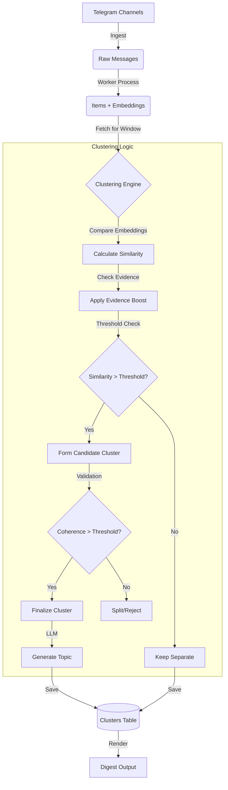

# Semantic Clustering

The clustering system groups semantically similar items (messages/articles) to reduce redundancy in the digest. By identifying stories that cover the same event or topic, the system can present a cleaner, more consolidated view of the news.

## How It Works

The clustering process runs during the digest generation phase (in the Scheduler) and consists of several steps:

1.  **Embedding Comparison**: The system uses vector embeddings (generated during ingestion) to calculate the cosine similarity between items.
2.  **Grouping**: Items that exceed the `CLUSTER_SIMILARITY_THRESHOLD` are grouped together.
3.  **Coherence Validation**: To prevent "chaining" unrelated items (A is like B, B is like C, but A is not like C), the system checks the average pairwise similarity of the proposed cluster. If it falls below `CLUSTER_COHERENCE_THRESHOLD`, the cluster is rejected or split.
4.  **Topic Generation**: An LLM generates a short, consistent topic label for the cluster (e.g., "SpaceX Launch").
5.  **Summarization**: If "Consolidated Clusters" are enabled, an LLM generates a single summary that synthesizes information from all items in the cluster.

### Algorithm Details

The core logic resides in `internal/output/digest/clustering.go`.

*   **Time Window**: Clustering is limited to a rolling time window (default 36 hours) to prevent linking old news with current events.
*   **Representative Item**: Each cluster is assigned a "representative item" (usually the one with the highest importance score) which acts as the anchor for the cluster.
*   **Caching**: Cluster summaries are cached based on a fingerprint of the item IDs to save LLM costs on subsequent runs.

## Configuration

Clustering behavior can be tuned via environment variables:

| Variable | Type | Default | Description |
| :--- | :--- | :--- | :--- |
| `CLUSTER_SIMILARITY_THRESHOLD` | float32 | `0.75` | Minimum cosine similarity (0-1) for two items to be considered related. |
| `CLUSTER_COHERENCE_THRESHOLD` | float32 | `0.70` | Minimum average pairwise similarity required for a valid cluster. |
| `CLUSTER_TIME_WINDOW_HOURS` | int | `36` | Maximum time difference between items in a cluster. |
| `CROSS_TOPIC_CLUSTERING_ENABLED` | bool | `false` | If true, allows clustering items that were initially categorized into different broad topics. |
| `EVIDENCE_CLUSTERING_ENABLED` | bool | `true` | If true, boosts similarity scores for items that share the same external evidence sources. |
| `EVIDENCE_CLUSTERING_BOOST` | float32 | `0.15` | The amount to boost the similarity score if evidence matches. |
| `EVIDENCE_CLUSTERING_MIN_SCORE` | float32 | `0.5` | Minimum initial similarity required before applying an evidence boost. |

## Advanced Features

### Evidence-Enhanced Clustering

When `EVIDENCE_CLUSTERING_ENABLED` is true, the system looks at the external links (evidence) associated with items. If two items link to the same external article (or very similar ones), their similarity score is boosted. This helps group items that report on the same source even if their text descriptions vary significantly.

### Consolidated Clusters

This feature (enabled via `/settings` in the bot or `consolidated_clusters_enabled`) changes how clusters are rendered in the final digest.

*   **Standard Mode**: The representative item is shown, with a mention of "X other sources".
*   **Consolidated Mode**: The system generates a *new* summary that merges facts from all items in the cluster. This is ideal for "Editor-in-Chief" style digests where the goal is a narrative overview.

### Research & Analytics

The clustering system underpins several research tools (see `internal/research/`):

*   **Timeline Analysis**: Tracking how a story evolves over time by following the cluster's timeline.
*   **Channel Overlap**: Calculating the "Jaccard Index" between channels based on how often they end up in the same clusters. This helps identify channels that copy each other or cover identical beats.
*   **Origin Detection**: Identifying which channel "broke" the story (first appearance in the cluster).

## Troubleshooting

*   **Clusters are too loose (unrelated items)**: Increase `CLUSTER_SIMILARITY_THRESHOLD` or `CLUSTER_COHERENCE_THRESHOLD`.
*   **Duplicate items not clustering**: Decrease `CLUSTER_SIMILARITY_THRESHOLD`. Check if items are outside the `CLUSTER_TIME_WINDOW_HOURS`.
*   **Performance**: Large windows with many items can be slow. The system limits clustering to `ClusterMaxItemsLimit` (default 500) items per run to maintain performance.
