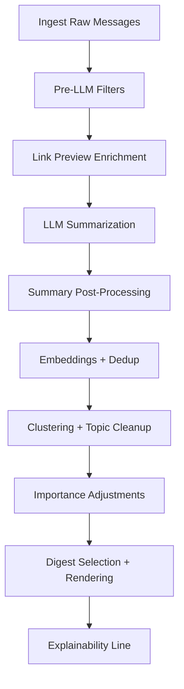

# Digest Quality Improvements (No Extra LLM Cost)

> **Status: PROPOSAL** (January 2026)
>
> Focus: improve digest quality using heuristics, caching, and metadata. No additional LLM calls.

## Summary
Improve relevance, readability, and diversity of the digest without increasing LLM usage. Changes target pre-LLM filtering, deduplication, ranking adjustments, summary polishing, and stronger use of existing metadata (link previews, channel stats, ratings).

## Goals
- Reduce low-signal items and near-duplicate spam.
- Improve summary clarity and consistency.
- Boost items corroborated across channels.
- Make inclusion decisions more transparent.
- Keep LLM usage flat or lower.

## Non-Goals
- New LLM prompts or additional LLM calls.
- Full UI redesign (covered elsewhere).

## Proposed Changes

### 1) Smarter Pre-LLM Filters (Language-Aware)
- Use language-aware minimum length rules (RU/UK/EN can differ).
- Drop emoji-only, boilerplate promos, and empty forwarded shells.
- **Do not drop link-only posts**; instead use link preview data (title/description/site) as text.

**Heuristics:**
- If message text is short but has `webpage.title/description`, synthesize a surrogate text for scoring.
- Boilerplate denylist should use CTA-style patterns (e.g., line starts with “subscribe”, “share this”, “подписывайтесь”, “репост”) and footer blocks.
- Avoid keyword-only matches inside normal sentences (e.g., “shares concerns”, “subscribe to the theory”).

### 2) URL Normalization + Domain Quality Signals
- Normalize URLs (strip tracking params, canonicalize paths).
- Add allowlist/denylist for low-value domains.
- Prefer reputable domains when summarizing clusters (ranking boost).

**Curation:**
- Lists are maintained manually by admins (config/env or ConfigMap).
- Review cadence: monthly or as-needed when noise is detected.
- If lists are empty, no domain bias is applied.

### 3) Telegram Link Preview Enrichment (No LLM)
- For short messages, append preview title/description to the text used for scoring.
- Store preview-derived snippet for display or evidence context.

**Source of preview data:**
- Use Telegram `webpage` fields from MTProto ingest (title/description/site name).
- If preview is missing or blocked, skip enrichment and score on message text only.
- Dependency: ingest must persist `webpage` metadata in raw messages or link cache.

### 4) Language Detection Normalization
- Detect language from original text + preview text + summary.
- Avoid false RU/UK flips by using a stable precedence (original > preview > summary).

**Detection method:**
- Use existing language detector in pipeline (no new LLM call).
- Pipeline order: detect on original/preview first; if unknown, fall back to LLM summary language.
- Store a `language_source` indicator (original/preview/summary) for debugging.

### 5) Stronger Dedup
- Combine strict hash + semantic similarity + time window.
- Treat same-channel near-duplicates as one item within a time window.

**Integration detail:**
- Extend semantic dedup to accept `channel_id` + `window_start/window_end`.
- Repository query should filter candidates by time window and optionally by channel:
  - same-channel duplicates: strict lower threshold within short window (e.g., 6h)
  - cross-channel duplicates: current threshold within standard window (e.g., 36h)
- `FindSimilarItem()` should gain optional parameters (time window + channel scope) or a new method `FindSimilarItemInWindow(channelID, since, threshold)`.

**Window semantics:**
- Sliding window relative to item timestamp (not calendar-based).
- Default `DEDUP_SAME_CHANNEL_WINDOW_HOURS=6` (configurable).
- Cross-channel window defaults to existing cluster time window (36h if unset).

### 6) Corroboration-Based Importance Adjustment
- Boost importance when multiple channels appear in same cluster.
- Penalize repeated single-source reposts.

**Ordering note:**
- Clustering occurs after initial LLM scoring; this boost must be applied post-clustering.
- Implementation options:
  1) Recalculate importance after clustering before digest selection, or
  2) Store a secondary `importance_adjusted` used only for ranking.

### 7) Channel Reliability/Weight History
- Apply reliability decay and stronger penalties for high irrelevant rates.
- Promote channels with sustained high "good" ratings.

### 8) Summary Post-Processing (Heuristic)
- Enforce single-sentence and length cap.
- Avoid altering factual meaning; keep hedging unless it is part of a known boilerplate prefix.
- Normalize punctuation and whitespace.

**Notes:**
- “Single sentence” is a preference: allow 2 sentences if the second is short (<80 chars).
- Hedging list is configurable per language; default set includes RU/EN common boilerplate.
- Strip phrases only when they appear as prefix or standalone line; do not rewrite middle-of-sentence text.

### 9) Lead Sentence Extraction Fallback
- If summary is weak, pick the best lead sentence from original/preview text.
- Prefer sentences with lightweight signals (numbers/dates, capitalized proper-noun patterns, @mentions, hashtags, acronyms).

### 10) Cluster Topic Cleanup
- Canonicalize topic labels (case, punctuation, synonyms).
- Deduplicate similar topics in a window.

### 11) Explainability Line
- Optional metadata line: why included (scores, corroboration, thresholds).

**Format:**
- Human-readable line in digest footer: `why: rel 0.62 | imp 0.41 | corr 3ch | gate: pass`.
- Controlled by `EXPLAINABILITY_LINE_ENABLED` to avoid leaking in public channels.
- Computed at render time; no persistence required.

### 12) Ratings-Driven Threshold Tuning (Weekly)
- Adjust relevance/importance thresholds using rating history.

### 13) Time-to-Digest Tracking
- Track time from first seen to digest inclusion.
- Flag windows with quality drops (few items, low average importance).

### 14) Cache LLM Summaries for Exact Duplicates
- Reuse prior summary for exact duplicates to reduce LLM usage.

### 15) Reuse Cluster Summaries Across Windows
- If a cluster repeats with minimal change, reuse its previous summary.

## Pipeline Integration
This proposal applies changes at specific points in the pipeline.

### Integration Points (by component)
- **Pre-LLM Filters**: `internal/process/filters`, `internal/process/pipeline`
- **Link Preview Enrichment**: `internal/process/pipeline` (augment text before scoring)
- **Summary Post-Processing**: `internal/process/pipeline` (after LLM results)
- **Lead Sentence Fallback**: `internal/process/pipeline` (when summary weak)
- **Stronger Dedup**: `internal/process/dedup`
- **Topic Cleanup**: `internal/output/digest/clustering`
- **Importance Adjustments**: `internal/process/pipeline` (post-LLM, pre-selection)
- **Explainability Line**: `internal/output/digest/digest_render`
- **Threshold Tuning**: scheduled job in worker (`internal/app`, `internal/process/pipeline`)

## Settings / Config Additions
- `FILTER_MIN_LENGTH_RU`, `FILTER_MIN_LENGTH_EN`, `FILTER_MIN_LENGTH_UK`
- `DOMAIN_ALLOWLIST`, `DOMAIN_DENYLIST`
- `DEDUP_SAME_CHANNEL_WINDOW_HOURS`
- `CORROBORATION_IMPORTANCE_BOOST`
- `SINGLE_SOURCE_PENALTY`
- `SUMMARY_MAX_CHARS`, `SUMMARY_STRIP_PHRASES`
- `EXPLAINABILITY_LINE_ENABLED`
- `TIME_TO_DIGEST_ALERT_THRESHOLD`

### Defaults + Validation
- Provide safe defaults for all new settings to avoid config explosion.
- Validate ranges (e.g., thresholds 0-1, window hours > 0).
- Prefer grouped configs (e.g., `FILTER_MIN_LENGTH_*`) over many single toggles.

**Proposed defaults:**
- `FILTER_MIN_LENGTH_RU=20`, `FILTER_MIN_LENGTH_UK=20`, `FILTER_MIN_LENGTH_EN=15`
- `DEDUP_SAME_CHANNEL_WINDOW_HOURS=6`
- `CORROBORATION_IMPORTANCE_BOOST=0.08`
- `SINGLE_SOURCE_PENALTY=0.05`
- `SUMMARY_MAX_CHARS=220`
- `SUMMARY_STRIP_PHRASES` (per language, small curated list)
- `EXPLAINABILITY_LINE_ENABLED=false`
- `TIME_TO_DIGEST_ALERT_THRESHOLD=6h`

## Data Storage Additions
Some changes require persistent state. Proposed schema additions:

- **Channel reliability history**: `channel_quality_history` table (channel_id, date, inclusion_rate, noise_rate, avg_importance, avg_relevance).
- **Weekly threshold tuning**: `threshold_tuning_log` table (date, relevance_threshold, importance_threshold, rationale).
- **Time-to-digest tracking**: add `first_seen_at` to items (or a separate `item_lifecycle` table).
- **Cluster summary reuse**: `cluster_summary_cache` table (cluster_fingerprint, summary, model, prompt_version, updated_at).

If storage changes are out of scope, these features should be deferred.

## Dependencies Checklist
- MTProto ingest persists `webpage` metadata (title/description/site).
- Link preview extraction is stable for short/empty messages.
- Ratings pipeline is enabled (for weekly tuning + reliability history).
- Cluster fingerprinting available (sorted item IDs + time window).

## Success Criteria
- Baseline: measure current “low-signal” rate over 7 days before rollout.
- “Low-signal” definition: items dropped by filters + items below relevance/importance thresholds + items rated bad/irrelevant (if available).
- Target: 15-25% reduction in low-signal rate vs baseline.
- Improved average importance without lowering topic diversity.
- Lower duplicate rate in a single digest.

## Caching Strategy
- Summary cache key: raw message hash + model + prompt version (or prompt hash).
- Cache only when message is an exact duplicate or identical preview-based surrogate text.
- Include preview signature (title/description hash) in the cache key to avoid mismatches.
- Invalidate when prompt version changes or TTL expires (default 30 days).
- Cache storage: PostgreSQL tables proposed in “Data Storage Additions” (no new infra).
- Cluster summary reuse only when cluster fingerprint (sorted item IDs) is unchanged.

## Rollout
- Stage 1: Enable preview-based enrichment + dedup window (requires MTProto preview fields).
- Stage 2: Importance adjustments + summary post-processing.
- Stage 3: Explainability line + weekly tuning.

**Rollback:**
- Disable via settings flags; revert to baseline behavior without schema drops.

## Testing Strategy
- **Shadow mode**: compute adjusted scores but do not affect ranking; log deltas.
- **A/B via time windows**: alternate windows with feature on/off for 1 week.
- **Regression suite**: replay a fixed sample of messages and compare selection stats.

## Monitoring & Alerting
- Metrics:
  - `digest_low_signal_rate` (filters + below thresholds + bad/irrelevant ratings)
  - `digest_duplicate_rate` (per window)
  - `digest_avg_importance` / `digest_avg_relevance`
  - `digest_time_to_digest_p50/p90`
- Alerts:
  - low-signal rate increases > 15% vs baseline
  - average importance drops > 0.1 for 3 consecutive windows

### Grafana Dashboards (new)
- **Quality Overview**: low-signal rate, avg importance/relevance, duplicate rate.
- **Dedup Health**: strict vs semantic hits, same-channel vs cross-channel counts.
- **Time-to-Digest**: p50/p90 per window, outlier windows highlighted.
- **Channel Reliability**: inclusion/noise rate trends, auto-weight changes.

## Migration Plan
- Feature flags default off.
- Enable during low-traffic window; avoid mid-window toggles.
- In-flight digests keep previous settings; new window picks up updated settings.

## Performance Impact
- Target per-message overhead: <5ms for new heuristics.
- Use cached preview fields; avoid extra network calls.
- Batch DB reads where possible (channel stats, denylist).

## Error Handling
- Denylist/allowlist lookup failures: log and skip biasing for that item.
- Uncertain language detection: default to original message language or `unknown`.
- If preview data is malformed or missing: fall back to raw message text.

## Open Questions
- Exact heuristics for lead sentence extraction?
- Should domain quality signals affect relevance, importance, or both?
- How much transparency to show in public digests?

## Example Heuristics
**CTA/boilerplate regexes (illustrative):**
- `^(subscribe|share this|donate|support us)\\b`
- `^(подписывайтесь|поддержите|поделитесь)\\b`
- `(?i)\\b(подписка|донат|спонсор)\\b` when in footer block only
