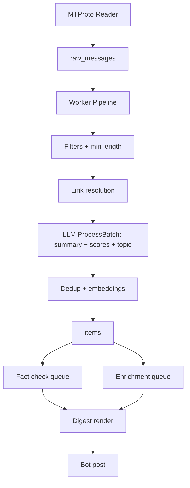
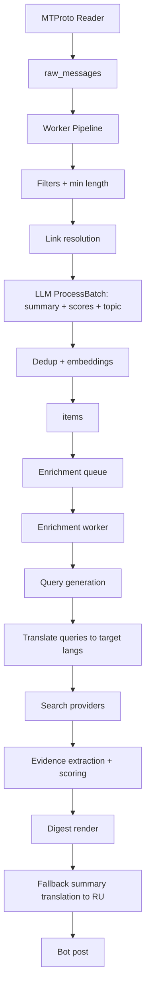

# Enrichment Language Routing

## Summary
Add language-aware search routing so enrichment queries are translated into the most useful source languages while the digest remains in Russian. This targets two needs: (1) prefer English sources for general news trust, (2) prefer Greek sources for Cyprus-local coverage.

## User Use Case
- Digest language: Russian (preferred reading language).
- Trust: prefer English sources for verification.
- Region: Cyprus news should be corroborated in Greek because English coverage is sparse.

## Goals
- Route enrichment queries to English by default.
- Route Cyprus-local items to Greek sources.
- Keep digest output language unchanged (Russian).
- Make rules configurable without code changes.

## Non-Goals
- Automatic truth certification.
- Replacing existing scoring or clustering logic.

## Walk-through Example
**Item**: summary = "В Никосии сообщили о перебоях с водой." topic = "Local News", channel = @russiancyprusnews  
**Step 1: Context detection**
- Channel description contains "Cyprus" → context `cyprus`.
**Step 2: Policy match**
- Channel rule matches first → languages = `["el"]`.
**Step 3: Query generation**
- Base query (RU) → "перебои с водой Никосия".
**Step 4: Translation**
- Translate to Greek → "διακοπές νερού Λευκωσία".
**Step 5: Provider search**
- Run Greek query with language filter where supported.
**Step 6: Digest output**
- Summary remains Russian; corroboration lines include Greek sources.

## Current Pipeline Flow (Baseline)


## Proposal
### 1) Language Routing Policy
Introduce a JSON policy setting (stored in `settings`):
`enrichment_language_policy`:
```json
{
  "default": ["en"],
  "topic": {
    "Local News": ["el"]
  },
  "context": [
    {
      "name": "cyprus",
      "languages": ["el"],
      "keywords": ["cyprus", "κϋπρος", "κyπρος", "nicosia", "limassol", "larnaca", "paphos", "κyπρ"]
    }
  ],
  "channel": {
    "@russiancyprusnews": ["el"]
  }
}
```
Rules are evaluated in order: channel → context → topic → default. First match wins (no merging across rules). Example: if a channel rule matches, topic rules are ignored.

### Context Detection
Context labels (e.g., `cyprus`) are derived from:
1. **Channel description**: keyword match against `channels.description` (auto-fetched from Telegram channel metadata during reader sync; highest confidence). Matching is case-insensitive.
2. **Historical messages**: rolling keyword match against recent item summaries for the channel (last N items), case-insensitive.
3. **Current item text**: keyword match against `summary + channel_title` (case-insensitive), in array order.
4. **Location entities**: if entity extraction yields a known location alias (case-insensitive, lower confidence).
Detection is evaluated in this order (highest confidence first). The first matching context wins; lower-confidence sources are not considered once a match is found.

### 2) Query Translation by Target Language
When generating enrichment queries:
- Detect item language from summary.
- For each target language in the policy, translate the query to that language.
- Run provider search per target language with provider language filters.

#### Language Detection
- Use the existing heuristic detector in `internal/process/enrichment/query_generator.go` (`detectLanguage`).
- If the LLM already returns a language label for the item, prefer it and fall back to heuristics.

#### Translation Implementation
Choose one translator implementation (configurable):
- **LLM translation** (default if LLM client is available): higher cost, best quality.
- **External API** (Google/DeepL): lower latency per query, paid API key required.
- **Dictionary fallback**: small static map for Cyprus-specific terms (lowest cost, limited coverage).

**Default behavior**: LLM translation, with a hard per-item cap (e.g., 4 queries max). If translation fails, fall back to the original language query.

**Cost/Latency notes**:
- LLM translation adds 1 call per query per target language.
- External API adds a request per query per target language.
- Use caching by `(query, target_lang)` with TTL=24h to reduce cost. Cache is query-level (shared across items).

#### Query Cap & Execution
- Cap is **per item total**, across all languages (default 4).
- When the cap is hit, drop lowest-priority languages first (order: channel → context → topic → default; for multi-lang lists, keep the first language and drop the rest).
- Execution: run queries in parallel but enforce a per-item timeout (e.g., 60s) and per-provider RPM limits.

#### Translation Fallback
- If translation fails or returns empty text: run the original query for that target language.
- No retries in v1 (avoid extra latency); failures are logged.
- If a translated query looks like meta-text (e.g., contains "translation" or long explanations), discard it and use the original query.

### 3) Provider Routing
- If provider supports language filters (SearxNG, NewsAPI, EventRegistry), pass target language.
- If provider does not (YaCy), do not rely on TLDs for language. Instead:
  - Run search normally.
  - Filter results by detected content language using extracted `title + description + content`.
  - Optionally apply TLD boosts as a weak hint, not a filter.

## Target Pipeline (Language Routing)


## Configuration
New setting (JSON):
- `enrichment_language_policy`

Optional overrides:
- `ENRICHMENT_LANGUAGE_POLICY` (env default if no setting present)

## Language Codes
All language values use ISO 639-1 codes (e.g., `ru`, `en`, `el`). This is the expected format in settings and provider filters.

## Translation Cache Storage
- Default: database table `translation_cache` keyed by `(query, target_lang)` with TTL.
- Alternative: in-memory cache for local/dev mode only (not persistent).

## Observability
Log per query:
- `query_lang`, `target_lang`, `translated=true|false`, `provider`.

Track success metrics:
- **Corroboration rate** = items with ≥1 evidence source above `ENRICHMENT_MIN_AGREEMENT` / total enriched items.
- **Greek routing coverage** = % of Cyprus-context items that produced ≥1 Greek-language result.
- **Zero-result rate** per target language.

### Metrics Storage
- Metrics are exported to Prometheus (existing `observability` counters/gauges).
- For longer-term reporting, add daily aggregates in a DB table (optional, v2).

## Testing Strategy
- Unit tests for:
  - Policy matching order (channel → context → topic → default).
  - Context detection sources (description, historical, current, entity).
  - Query cap behavior and language drop order.
  - Translation fallback on failure or meta-text output.
- Integration test (optional): mock providers + translator to verify multi-language merge/dedup.

## Limitations
- Translation quality may be weaker for technical/legal terms.
- Greek news coverage can be sparse or paywalled; some providers return few results.
- Language detection is heuristic and may misclassify short or mixed-language summaries.

## Rollout
1. Ship policy parsing with default `{"default":["en"]}`.
2. Add Cyprus-specific rules for Greek.
3. Monitor query success and corroboration rate for Cyprus topics.

## Acceptance Criteria
- For items labeled `Local News` with context containing `Cyprus`, enrichment queries run in `el`.
- For other items, enrichment queries run in `en`.
- Digest language remains `ru`.
- Greek routing success: ≥30% of Cyprus-context items produce at least one Greek-language evidence source (measured over 2 weeks).
- No more than +10% regression in overall corroboration rate vs baseline.

## Multi-language Result Handling
- Merge all results across languages into a single list.
- Deduplicate by normalized URL (strip tracking params).
- If one language returns results and another fails/timeouts, continue with available results.
