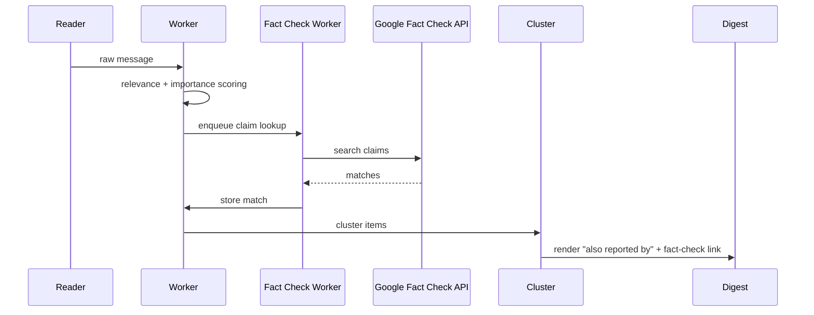
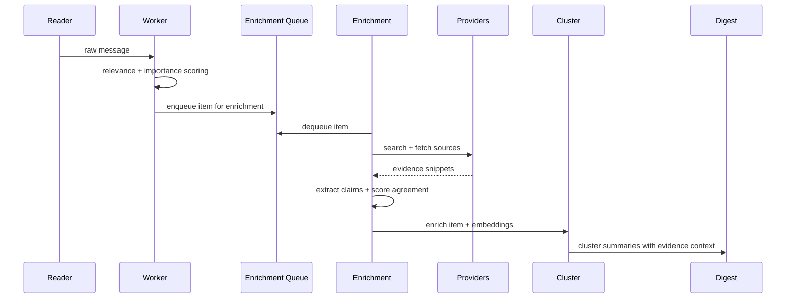

# Source Enrichment & Fact-Checking Pipeline

> **Status: Phase 2 Partially Implemented** (January 2026)
>
> Phase 1 is complete. Phase 2 core functionality works but has gaps (see Known Gaps section).
> See [docs/features/corroboration.md](../features/corroboration.md) for user-facing documentation.
> Phase 2 is enabled via `ENRICHMENT_ENABLED=true`.

## Summary
Two-phase rollout:
1. **Phase 1** ✅ Channel corroboration + Google Fact Check API (implemented)
2. **Phase 2** 🟡 Evidence retrieval, extraction, and agreement scoring (partial - see Known Gaps)

## Goals
- Improve factual accuracy and context with measurable outcomes.
- Keep Phase 1 low-risk and fast to ship.
- Use Phase 2 only if Phase 1 proves insufficient.

## Non-Goals
- Fully automated truth certification.
- Replacing the existing summarization pipeline.

## Problem Statement & Baseline
We need a baseline before rollout:
- % of items rated bad/irrelevant due to factual errors.
- % of items with conflicting user comments (manual “fact issue” tag).
- % of clusters with cross-topic contamination.

Measure for **2 weeks** and use as the baseline for success targets.

## Phase 1: Channel Corroboration + Google Fact Check API
Immediate value using existing clustering and human-verified claims.

### Flow
1. **Channel corroboration**
   - Count how many tracked channels reported similar content.
   - Use existing clustering to derive “also reported by” list.
   - Output example: `Also reported by: @channel1, @channel2`.
   - Edge case: if only the same channel appears, omit the line or show `Related: <link>` for same-channel duplicates.
2. **Fact-check lookup**
   - Generate a short claim string (single sentence).
   - Query Google Fact Check API.
   - If a match is found: `Related fact-check: <link>`.
   - Store match URL, publisher, and rating.
3. **Caching + rate limits**
   - Cache results by normalized claim (TTL).
   - Apply per-provider RPM limits and track errors.

### Why Phase 1 First
- Reuses existing clustering.
- Low false positives (human-verified sources).
- Minimal maintenance and fast to ship.

## Phase 2: Full Evidence Enrichment
Adds evidence retrieval, extraction, and agreement scoring.

### Flow
1. **Item normalization**
   - Extract entities, key phrases, and short claim summary.
2. **Query generation**
   - Build 2-4 queries per item.
   - Algorithm (v2):
     - Use LLM summary + entities:
       - Q1: `<primary_entity> <verb> <object>`
       - Q2: `<primary_entity> <location> <date_or_time>`
       - Q3: `<topic> <primary_entity> <keyword>`
     - Fallback to top keywords + channel name if extraction fails.
     - Strip emojis/mentions/hashtags unless essential.
     - Deduplicate queries.
3. **Source retrieval**
   - Parallel retrieval within per-item time budget (30-60s).
   - Fetch top N sources (default 3-5).
4. **Evidence extraction**
   - Prefer structured metadata (OpenGraph, RSS/Atom, JSON-LD).
   - Fallback to readability extraction.
   - Claim extraction:
     - Sentence ranking (TextRank/keyword overlap).
     - Optional LLM pass for top 1-2 sources.
   - Failure: store URL with `extraction_failed=true`, proceed with fewer evidence rows.
5. **Fact-check scoring**
   - Agreement score = claim similarity + entity overlap.
   - Contradiction detection if core claims diverge.
6. **Context injection**
   - Add “Evidence” and “Background” bullets to prompts.
7. **Clustering improvement**
   - Use evidence embeddings to tighten clusters.

## Execution Model & Backpressure
Phase 1:
- Corroboration is computed at digest render time.
- Google Fact Check runs in a `factcheck` worker queue.
- Backpressure: queue size limits, per-item timeout, cache TTL.

Phase 2:
- Enrichment runs asynchronously in a dedicated `enrichment` worker queue.
- Backpressure: queue length thresholds, per-item timeouts, per-provider budgets.

## Sequence Diagrams
### Phase 1

### Phase 2

## Integration Points
- **Ordering**:
  - Phase 1 uses existing clustering output for “also reported by”.
  - Phase 2 enrichment runs before clustering.
- **Scoring impact**:
  - Phase 1 does not change relevance/importance.
  - Phase 2 adds `fact_check_score` and confidence tier only.
- **Summarization**:
  - Phase 1 adds “Also reported by” + optional fact-check link.
  - Phase 2 adds evidence bullets when available.

## Degradation Behavior
Phase 1:
- If Google Fact Check returns nothing or errors, omit the link and proceed.

Phase 2:
- If no sources found: mark Low confidence, omit evidence bullets.
- If sources disagree: mark Low confidence with “conflicting sources”.
- If pipeline errors: proceed without enrichment.

## Data Model Changes
Phase 1:
- `item_fact_checks` (item_id, claim, url, publisher, rating, matched_at)
- Channel corroboration is derived from clusters (optional cache table).
- Optional: `fact_check_cache` (normalized_claim, result_json, cached_at)

Phase 2:
- `evidence_sources` (id, url, domain, title, published_at, language, raw_text)
- `evidence_claims` (id, evidence_id, claim_text, embedding, entities)
- `item_evidence` (item_id, evidence_id, agreement_score, contradiction, matched_at)
- Add to `items`:
  - `fact_check_score` (float)
  - `fact_check_tier` (high|medium|low)
  - `fact_check_notes` (text/json)

## Configuration
Phase 1:
- `FACTCHECK_GOOGLE_ENABLED=true`
- `FACTCHECK_GOOGLE_API_KEY=...`
- `FACTCHECK_GOOGLE_MAX_RESULTS=3`
- `FACTCHECK_CACHE_TTL_HOURS=48`
- `FACTCHECK_GOOGLE_RPM=60`
- `FACTCHECK_MIN_CLAIM_LENGTH=40`

Phase 2:
- `ENRICHMENT_ENABLED=true`
- `ENRICHMENT_MAX_SOURCES=5`
- `ENRICHMENT_MAX_SECONDS=60`
- `ENRICHMENT_MIN_AGREEMENT=0.65`
- `ENRICHMENT_ALLOWLIST_DOMAINS` / `ENRICHMENT_DENYLIST_DOMAINS`
- `ENRICHMENT_QUERY_TRANSLATE=true`
- `ENRICHMENT_PROVIDERS=yacy,gdelt,searxng`

YaCy-specific:
- `ENRICHMENT_YACY_ENABLED=true`
- `ENRICHMENT_YACY_URL=http://localhost:8090`
- `ENRICHMENT_YACY_TIMEOUT=10s`
- `ENRICHMENT_YACY_MAX_RESULTS=10`

SearxNG-specific:
- `SEARXNG_ENABLED=true`
- `SEARXNG_BASE_URL=http://localhost:8888`
- `SEARXNG_TIMEOUT=30s`
- `SEARXNG_ENGINES=google,duckduckgo` (optional)

Event Registry-specific:
- `ENRICHMENT_EVENTREGISTRY_ENABLED=true`
- `ENRICHMENT_EVENTREGISTRY_API_KEY=...`
- `ENRICHMENT_EVENTREGISTRY_RPM=30`
- `ENRICHMENT_EVENTREGISTRY_TIMEOUT=30s`

NewsAPI-specific:
- `ENRICHMENT_NEWSAPI_ENABLED=true`
- `ENRICHMENT_NEWSAPI_KEY=...`
- `ENRICHMENT_NEWSAPI_RPM=100`
- `ENRICHMENT_NEWSAPI_TIMEOUT=30s`

OpenSearch-specific:
- `ENRICHMENT_OPENSEARCH_ENABLED=true`
- `ENRICHMENT_OPENSEARCH_URL=http://localhost:9200`
- `ENRICHMENT_OPENSEARCH_INDEX=news`
- `ENRICHMENT_OPENSEARCH_RPM=60`
- `ENRICHMENT_OPENSEARCH_TIMEOUT=30s`

Evidence management:
- `ENRICHMENT_EVIDENCE_TTL_DAYS=30`
- `ENRICHMENT_EVIDENCE_DEDUP_SIM=0.98`
- `ENRICHMENT_EVIDENCE_MAX_PER_ITEM=5`
- `ENRICHMENT_DAILY_LIMIT=1000`
- `ENRICHMENT_MONTHLY_LIMIT=20000`

## Source Catalog (Phase 2)
Providers (query APIs):
- ✅ **YaCy** (self-hosted, recommended primary) - decentralized P2P search engine with JSON API
- ✅ **GDELT** 2.1 Events + GDELT DOC 2.1
- ✅ **Event Registry** - commercial news API with global coverage
- ✅ **NewsAPI** - news aggregation API
- ✅ **SearxNG** (self-hosted metasearch) - aggregates multiple search engines
- ✅ **OpenSearch** (self-hosted) - Elasticsearch-compatible search engine for custom news index

### YaCy Integration
YaCy is a self-hosted, decentralized search engine that can be configured to crawl trusted news domains.

**Benefits:**
- Zero API cost (self-hosted)
- No rate limits (limited only by hardware)
- Custom index (crawl only allowlist domains)
- Privacy (queries stay local)
- Offline capable (works if external APIs fail)

**API endpoint:** `GET /yacysearch.json?query=<query>&count=10`

**Deployment:** Docker recommended (`yacy/yacy_search_server`)

**Crawl strategy:** Configure YaCy to crawl allowlist domains (Reuters, AP, BBC, etc.) on a schedule. This pre-indexes trusted sources for fast local queries.

Default allowlist domains (seed list, extendable):
- Global: `reuters.com`, `apnews.com`, `bbc.com`, `aljazeera.com`, `dw.com`
- Tech/Science: `nature.com`, `sciencemag.org`, `arxiv.org`, `mit.edu`, `wired.com`
- Ukraine: `pravda.com.ua`, `suspilne.media`, `unian.net`, `ukrinform.net`
- Russia (reference/corroboration): `meduza.io`, `theins.ru`, `novayagazeta.eu`
- Official: `*.gov`, `*.mil`, `who.int`, `un.org`, `europa.eu`

## Source Selection Rules (Phase 2)
- Prefer high-trust domains; demote link farms and anonymous blogs.
- Require at least one non-social source for High confidence.
- Social sources are context only (never sole evidence).

## Entity Overlap Ratio (Phase 2)
- Normalize entities:
  - Lowercase + whitespace cleanup
  - RU↔EN transliteration normalization
  - Alias expansion (e.g., Kyiv/Kiev)
- Overlap ratio:
  - `overlap = |intersection| / |union|`
  - Weight PERSON/ORG/LOC higher than MISC.

## Source Catalog Maintenance (Phase 2)
- Admin-configurable allowlist/denylist via settings.
- `/enrichment domains add|remove|list` command.
- Monthly review to prune dead domains and add official sources.

## Language Handling
- Detect language for each item/snippet.
- If non-EN/RU, translate queries only (not content).
- Use multilingual embeddings.
- Mixed language: if confidence < 0.7, generate queries in original + EN.

## Evidence Retention & Storage Control (Phase 2)
- `ENRICHMENT_EVIDENCE_TTL_DAYS` cleanup job (daily).
- Deduplicate evidence claims by embedding similarity (>= 0.98).
- Keep only top N evidence rows per item (default 5).

## Observability
Metrics:
- Fact-check API latency + error rate.
- Fact-check match rate (% items with related claims).
- Channel corroboration coverage (% items with >=1 other channel).
- Enrichment latency histogram (overall + per provider).
- Provider error rate and circuit breaker opens.
- Cache hit/miss rate for evidence queries.
- Evidence match rate (% items with >=1 corroborating source).

Logging:
- Enrichment start/end per item with outcome and latency.

## Risks & Mitigations
- Latency spikes: per-item timeouts + global 5-minute cap.
- Source noise: domain allow/deny lists and quality weighting.
- Hallucinations: keep evidence links; never claim certainty.
- External API limits/downtime/cost:
  - Token buckets per provider.
  - Circuit breaker + cooldown.
  - Prioritize free sources first.
- LLM call explosion:
  - Accept higher cost in v1.
  - Track per-item call count and total cost for future controls.

## Provider Resilience
- `FACTCHECK_GOOGLE_RPM`
- `ENRICHMENT_YACY_TIMEOUT` (no RPM needed - self-hosted)
- `ENRICHMENT_GDELT_RPM`, `ENRICHMENT_EVENTREGISTRY_RPM`, `ENRICHMENT_NEWSAPI_RPM`
- `ENRICHMENT_PROVIDER_COOLDOWN=10m`
- Fallback order (Phase 2): **YaCy → GDELT → Event Registry → NewsAPI → SearxNG → OpenSearch**

YaCy is first because it's self-hosted (no cost, no rate limits). External APIs are fallbacks with rate limiting. OpenSearch is last as it requires a pre-populated index.

## Rollout Plan
Phase 1:
1. ✅ Add "also reported by" using clustering output.
2. ✅ Integrate Google Fact Check API and store matches.
3. ✅ Add digest output lines and Phase 1 metrics.

Phase 2:
1. ✅ Implement storage + retrieval behind `ENRICHMENT_ENABLED`.
2. 🟡 Add evidence extraction + scoring, log metrics. (basic extraction only)
3. 🟡 Integrate into summarization prompts. ("Supporting Evidence" only, no "Background")
4. ✅ Implement multi-provider support (YaCy, GDELT, Event Registry, NewsAPI, SearxNG, OpenSearch).
5. ⏳ Add language detection and query translation. (TranslationClient not wired)
6. ✅ Add admin domain management (`/enrichment domains`).
7. 🟡 Add budget controls (daily/monthly limits). (count-based only, USD caps not enforced)
8. ✅ Add embedding-based claim deduplication.
9. ✅ Clustering improvement with evidence embeddings.

## Known Gaps (Phase 2)
The following items from the proposal are not yet implemented:

1. **Query translation not wired**: `TranslationClient` exists but is never set in `app.go`, so `ENRICHMENT_QUERY_TRANSLATE` has no effect.

2. **Evidence extraction narrower than spec**:
   - Uses readability + OpenGraph meta + simple sentence heuristics only
   - No JSON-LD/RSS/Atom parsing
   - No TextRank sentence ranking
   - No optional LLM claim extraction

3. **No extraction failure flag**: Proposal mentions `extraction_failed=true` but `evidence_sources` table has no such field.

4. **Entity overlap normalization is basic**:
   - No RU↔EN transliteration
   - No alias expansion (e.g., Kyiv/Kiev)
   - Matching is exact string + entity type only

5. **"Background" bullets not surfaced**: Prompts include "Supporting Evidence" block but no "Background" section; digest output only shows "Corroborated" line.

6. **Sequential source retrieval**: Providers are queried with fallback sequentially, not in parallel within time budget as spec describes.

7. **USD budget caps not enforced**: `ENRICHMENT_DAILY_BUDGET_USD` / `ENRICHMENT_MONTHLY_CAP_USD` are configured but unused; only count-based limits (`ENRICHMENT_DAILY_LIMIT` / `ENRICHMENT_MONTHLY_LIMIT`) work.

8. **Observability gaps**:
   - No metric for corroboration coverage (% items with >=1 other channel)
   - No metric for circuit breaker opens

9. **Query fallback missing channel name**: Proposal says fallback uses "top keywords + channel name" but implementation doesn't include channel name.

## Testing Strategy
- Unit tests:
  - Fact-check response parsing + matching.
  - Query generation fallback behavior.
  - Entity normalization and overlap ratio.
  - Evidence extraction from HTML/RSS fixtures.
  - YaCy JSON response parsing.
  - OpenSearch JSON response parsing.
  - SearxNG JSON response parsing.
- Integration tests:
  - Mock Google Fact Check API.
  - Mock YaCy `/yacysearch.json` endpoint.
  - Mock provider responses for search + fetch.
  - Verify queue processing + timeout handling.
- Offline evaluation:
  - Run enrichment on labeled sample set and compare agreement tiers.
- Staging soak:
  - Enable on subset of channels for 7 days.

## Success Metrics
Targets vs baseline:
- Irrelevant rating rate: reduce by >=20% on annotated items.
- Cluster cohesion: increase average intra-cluster similarity by >=10%.
- Contradiction rate: reduce by >=25%.

## Phase 2 Go/No-Go Criteria
Proceed to Phase 2 only if at least one is true after Phase 1:
- Irrelevant/factual-error rate remains >=5% on high-importance items.
- Fact-check match rate is >=2%.
- Cluster cohesion remains below target after Phase 1.

## Research References (Applied)
- FEVER + EX-FEVER inform retrieval + verification separation and multi-hop evidence.
- Evidence summarization work informs “Evidence/Background” prompt sections.
- Factual consistency evaluation supports agreement/contradiction signals.
- ClaimBuster supports Phase 1 claim detection.
- Industry reports guide expectation management.

### References
- ClaimBuster (PVLDB 2017) https://doi.org/10.14778/3137765.3137815
- FEVER (2018) https://doi.org/10.18653/v1/n18-1074
- EX-FEVER (2024) https://doi.org/10.18653/v1/2024.findings-acl.556
- Improving Evidence Retrieval (2021) https://doi.org/10.18653/v1/2021.naacl-demos.10
- Complex Claim Verification (2024) https://doi.org/10.18653/v1/2024.naacl-long.196
- Evidence Embedding for Claim Verification (2019) https://doi.org/10.18653/v1/p19-1244
- Evidence Inference Networks (2021) https://doi.org/10.1609/aaai.v35i16.17655
- Evidence-Aware HIAN (2020) https://doi.org/10.24963/ijcai.2020/193
- MetaSumPerceiver (2024) https://doi.org/10.18653/v1/2024.acl-long.474
- Evaluating Factual Consistency (2020) https://doi.org/10.18653/v1/2020.emnlp-main.750
- Enhancing Factual Consistency (2021) https://doi.org/10.18653/v1/2021.naacl-main.58
- QAFactEval (2022) https://doi.org/10.18653/v1/2022.naacl-main.187
- Rumour Detection Survey (2018) https://doi.org/10.1145/3161603
- Reuters Institute report https://reutersinstitute.politics.ox.ac.uk/our-research/understanding-promise-and-limits-automated-fact-checking
- Frontiers in AI (2024) https://doi.org/10.3389/frai.2024.1341697
- SAGE Emerging Media (2024) https://doi.org/10.1177/27523543241280195
- GDELT Project https://www.gdeltproject.org/
- Rutgers RUcore (Corroborating information) https://rucore.libraries.rutgers.edu/rutgers-lib/51498/
- YaCy Decentralized Search Engine https://yacy.net/
- YaCy API Documentation https://wiki.yacy.net/index.php/Dev:API
- YaCy GitHub https://github.com/yacy/yacy_search_server
