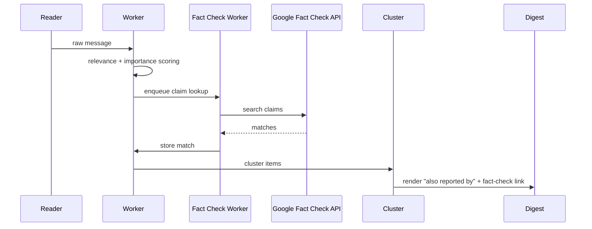
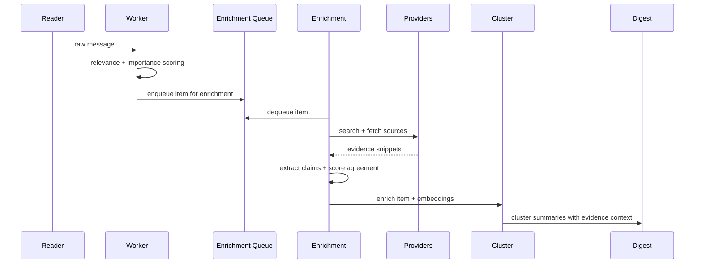

# Source Enrichment & Fact-Checking Pipeline

> **Status: Proposal** (not yet implemented)
>
> This document describes a future enhancement. Implementation has not started.

## Goal
Improve factual accuracy and context in two phases: immediate corroboration signals first, then full evidence enrichment.

## Problem Statement & Baseline
- Current issue size is unknown; we need a baseline before rollout.
- Add a 2-week measurement window:
  - % of items later rated bad/irrelevant due to factual errors (from ratings).
  - % of items with conflicting user comments (manual tag for “fact issue”).
  - % of clusters with cross-topic contamination (proxy for weak corroboration).
- These metrics define success thresholds for enrichment.

## Scope
- Phase 1 sources: Google Fact Check API + existing clustering.
- Phase 2 sources: all available (RSS/Atom, public APIs, web search, and known news sites).
- Latency: end-to-end enrichment must finish within **5 minutes** per digest window.
- Language: support RU/EN and handle mixed languages; do not block other languages.
- Cost: no ceiling initially; prioritize quality and productivity first, but track metrics so costs can be controlled later.

## Non-Goals
- Fully automated “truth” certification. We provide confidence signals, not absolute truth.
- Replacing the existing summary pipeline; this is an enrichment layer.

## Phase 1: Channel Corroboration + Google Fact Check API
Immediate value using existing clustering and human-verified claims.

### Flow (Phase 1)
1. **Channel corroboration**
   - For each item, count how many tracked channels reported similar content.
   - Use existing clustering to derive the “also reported by” list.
   - Output example: `Also reported by: @channel1, @channel2`
2. **Fact-check lookup**
   - Generate a short claim string (single sentence) for lookup.
   - Query Google Fact Check API for related claims.
   - If a match is found, add: `Related fact-check: <link>`
   - Store the match URL, publisher, and rating.
3. **Caching + rate limits**
   - Cache fact-check results by normalized claim (TTL).
   - Apply per-provider rate limits and surface error metrics.

### Why Phase 1 First
- Reuses existing clustering.
- Low false positives from human-verified sources.
- Minimal maintenance and fast to ship.

## Phase 2: Full Evidence Enrichment (Expanded Scope)
This phase adds evidence retrieval, extraction, and agreement scoring.

### Flow (Phase 2)
1. **Item normalization**
   - Extract entities, key phrases, and a short claim summary.
2. **Query generation**
   - Build 2-4 queries per item (native + translated if needed).
   - Algorithm (v2):
     - Use existing LLM summary + entities to form queries:
       - Q1: `<primary_entity> <verb> <object>` (short claim)
       - Q2: `<primary_entity> <location> <date_or_time>`
       - Q3: `<topic> <primary_entity> <keyword>`
     - If text is too informal or entity extraction fails:
       - Fallback to top 6 keywords (TF-IDF or YAKE) + channel name.
     - Strip emojis, mentions, and hashtags unless they are essential identifiers.
     - Deduplicate queries and keep the most distinct 2-4.
3. **Source retrieval**
   - Run retrieval in parallel with per-item time budget (e.g., 30-60s).
   - Fetch top N sources (default 3-5) by relevance and source quality.
4. **Evidence extraction**
   - For each source, extract headline, snippet, publish time, and key claims.
   - Extraction strategy:
     - Prefer structured metadata: OpenGraph, RSS/Atom fields, JSON-LD.
     - Fallback to readability extraction for headline/snippet.
     - Claim extraction:
       - v2: lightweight sentence ranking (TextRank/keyword overlap).
       - Optional LLM pass only for top 1-2 sources per item.
   - Failure mode:
     - If extraction fails, store the URL with `extraction_failed=true`.
     - The item proceeds with fewer evidence rows.
5. **Fact-check scoring**
   - Agreement score based on entity overlap + claim similarity.
   - Contradiction detection: flag if core claim differs from majority.
6. **Context injection**
   - Add “Evidence” and “Background” bullets to LLM prompt.
7. **Clustering improvement**
   - Use evidence embeddings to improve cluster cohesion and cross-source linking.

## Execution Model & Backpressure
Phase 1:
- **Channel corroboration** happens at digest render time using cluster membership.
- **Google Fact Check** runs asynchronously in a `factcheck` worker queue.
  - Backpressure: queue size limits + per-item timeout.
  - Cache: normalized claim key with TTL (avoid duplicate lookups).

Phase 2:
- Run enrichment asynchronously after initial scoring:
  - `worker` mode writes items as usual.
  - A new `enrichment` worker processes items from an `enrichment_queue`.
- Backpressure:
  - Queue length and processing lag thresholds.
  - Drop or defer enrichment when queue exceeds limits.
  - Per-item timeouts and per-provider budgets.

## Sequence Diagram
### Phase 1

### Phase 2

## Integration Points
- **Ordering**:
  - Phase 1 uses existing clustering output for “also reported by”.
  - Phase 2 enrichment runs **before clustering**, so evidence can improve cluster assignments.
- **Scoring impact**:
  - Phase 1 does **not** change raw relevance/importance.
  - Phase 2 does **not** change raw relevance/importance in v1.
  - It adds a `fact_check_score` and confidence tier only.
- **Summarization**:
  - Phase 1 adds “Also reported by” + fact-check link if present.
  - Phase 2 cluster summarization receives evidence bullets as optional context.
  - If no evidence, the prompt remains unchanged.

## Degradation Behavior
Phase 1:
- If Google Fact Check returns nothing or errors:
  - Item still proceeds without fact-check link.

Phase 2:
- If no sources found within budget:
  - Item still proceeds with a **Low** confidence tag.
  - No “Evidence” bullets added.
- If sources disagree:
  - Item proceeds, marked **Low** confidence + “conflicting sources” note.
- If enrichment pipeline errors:
  - Item proceeds without enrichment (log error, count metric).

## Value vs. Complexity
- Phase 1 is low-risk and immediate value.
- Phase 2 is gated behind `ENRICHMENT_ENABLED`; we can pilot on a subset.
- Primary value targets:
  - Reduce factual errors in high-importance items.
  - Provide better context for borderline relevance items.
  - Improve cluster cohesion on multi-source events.
- If baseline shows low error rates, scope can be reduced to:
  - High-importance items only
  - Or clusters with low cohesion

## Source Catalog (Phase 2)
Providers (query APIs):
- GDELT 2.1 Events + GDELT DOC 2.1
- Event Registry
- NewsAPI (if licensing allows)
- OpenSearch providers (Brave Search, SerpAPI, or self-hosted SearxNG)

Default allowlist domains (seed list, extendable):
- Global: `reuters.com`, `apnews.com`, `bbc.com`, `aljazeera.com`, `dw.com`
- Tech/Science: `nature.com`, `sciencemag.org`, `arxiv.org`, `mit.edu`, `wired.com`
- Ukraine: `pravda.com.ua`, `suspilne.media`, `unian.net`, `ukrinform.net`
- Russia (for reference/corroboration): `meduza.io`, `theins.ru`, `novayagazeta.eu`
- Official sources: `*.gov`, `*.mil`, `who.int`, `un.org`, `europa.eu`

## Source Selection Rules
- Prefer high-trust domains; demote anonymous blogs and link farms.
- Require at least one non-social source for **High** confidence.
- Keep social sources as context only (never sole evidence).

## Fact-Check Scoring (Phase 2)
- **Agreement score**: average cosine similarity of claim embeddings + entity overlap ratio.
- **Confidence tiers**:
  - High: ≥2 independent sources agree, no contradictions.
  - Medium: 1 corroborating source or weak agreement.
  - Low: no corroboration or contradictions detected.
- **Output**: store agreement score, contradiction flag, top evidence links.

## Entity Overlap Ratio
- Normalize entities via:
  - Lowercasing + whitespace cleanup
  - Transliteration normalization (RU↔EN variants)
  - Alias expansion for known entities (e.g., “Kyiv/Kiev”)
- Overlap ratio:
  - `overlap = |intersection(normalized_entities)| / |union(normalized_entities)|`
  - Weight PERSON/ORG/LOC higher than MISC.

## Source Catalog Maintenance
- Allowlist/denylist should be admin-configurable via settings:
  - `ENRICHMENT_ALLOWLIST_DOMAINS`
  - `ENRICHMENT_DENYLIST_DOMAINS`
- Add `/enrichment domains add|remove|list` command for runtime updates.
- Monthly review: prune dead domains, add missing official sources.

## Language Handling
- Detect language for each item and evidence snippet.
- If non-EN/RU, translate only the **query** (not the content) for retrieval.
- Use multilingual embeddings for claim similarity.
  - Mixed language handling:
    - If language detector returns “mixed” or <0.7 confidence, generate queries in original + EN.
    - Do not block; proceed with best-effort retrieval.

## Data Model Changes
Phase 1:
- `item_fact_checks` (item_id, claim, url, publisher, rating, matched_at)
- Channel corroboration is derived at render-time from clusters (optional cache table if needed).
Optional:
- `fact_check_cache` (normalized_claim, result_json, cached_at)

Phase 2:
- `evidence_sources` (id, url, domain, title, published_at, language, raw_text)
- `evidence_claims` (id, evidence_id, claim_text, embedding, entities)
- `item_evidence` (item_id, evidence_id, agreement_score, contradiction, matched_at)
Add fields:
- `items.fact_check_score` (float)
- `items.fact_check_tier` (enum: high|medium|low)
- `items.fact_check_notes` (text/json)

## Evidence Retention & Storage Control
- Add retention policy for evidence data:
  - `ENRICHMENT_EVIDENCE_TTL_DAYS=30` (configurable)
  - Periodic cleanup job (daily) to delete expired evidence rows.
- Deduplicate evidence claims:
  - On insert, compare claim embedding similarity; skip if similarity ≥ 0.98.
- Keep only top N evidence rows per item (default 5).

## Configuration
Phase 1:
- `FACTCHECK_GOOGLE_ENABLED=true`
- `FACTCHECK_GOOGLE_API_KEY=...`
- `FACTCHECK_GOOGLE_MAX_RESULTS=3`
- `FACTCHECK_CACHE_TTL_HOURS=48`
- `FACTCHECK_GOOGLE_RPM=60`
- `FACTCHECK_MIN_CLAIM_LENGTH=40`

Phase 2:
- `ENRICHMENT_ENABLED=true`
- `ENRICHMENT_MAX_SOURCES=5`
- `ENRICHMENT_MAX_SECONDS=60` (per item)
- `ENRICHMENT_MIN_AGREEMENT=0.65`
- `ENRICHMENT_ALLOWLIST_DOMAINS` / `ENRICHMENT_DENYLIST_DOMAINS`
- `ENRICHMENT_QUERY_TRANSLATE=true`
- `ENRICHMENT_PROVIDERS=gdelt,eventregistry,newsapi,opensearch`
- `ENRICHMENT_EVIDENCE_TTL_DAYS=30`
- `ENRICHMENT_EVIDENCE_DEDUP_SIM=0.98`
- `ENRICHMENT_EVIDENCE_MAX_PER_ITEM=5`
- `ENRICHMENT_DAILY_BUDGET_USD=100` (warning threshold)
- `ENRICHMENT_MONTHLY_CAP_USD=2000` (hard stop)

## UX Impact
- Digest items include:
  - Phase 1: “Also reported by: …” + optional fact-check link
  - Phase 2: “Evidence: 3 sources, confidence: High”
  - Phase 2: optional 1-2 bullet “Context” lines
- Admin view (future): `/evidence <item_id>` to inspect sources.
Note: cap “also reported by” to the top 3 channels to keep output compact.

## Observability
- Metrics:
  - Fact-check API latency + error rate.
  - Fact-check match rate (% items with related claims).
  - Channel corroboration coverage (% items with ≥1 other channel).
  - Enrichment latency histogram (overall + per provider).
  - Provider error rate and circuit breaker opens.
  - Cache hit/miss rate for evidence queries.
  - Evidence match rate (% items with ≥1 corroborating source).
- Logging:
  - Enrichment start/end per item with outcome and time spent.

## Risks & Mitigations
- **Latency spikes**: enforce per-item timeout and global 5-minute cap.
- **Source noise**: domain allow/deny lists and source quality weight.
- **Hallucinations**: keep evidence links in output; never claim certainty.
- **External API limits/downtime/cost**:
  - Add per-provider rate limits with token buckets.
  - Circuit breaker: open on N consecutive failures, retry after cooldown.
  - Provider prioritization: free sources first, paid APIs only if needed.
  - Metrics per provider: success rate, latency, cost estimate.
- **LLM call explosion**:
  - In v1 we accept higher cost to maximize productivity.
  - Track per-item LLM call counts and total cost for future controls.

## Provider Resilience
- Default budgets per provider (requests/minute) and backoff:
  - `FACTCHECK_GOOGLE_RPM`
  - `ENRICHMENT_GDELT_RPM`, `ENRICHMENT_EVENTREGISTRY_RPM`, `ENRICHMENT_NEWSAPI_RPM`
  - `ENRICHMENT_PROVIDER_COOLDOWN=10m`
- Fallback order (Phase 2): OpenSearch → GDELT → Event Registry → NewsAPI.
- If all providers fail: proceed without enrichment (Low confidence).

## Rollout Plan
Phase 1:
1. Add “also reported by” using existing clustering output.
2. Integrate Google Fact Check API and store matches.
3. Add digest output lines and Phase 1 metrics.

Phase 2:
1. Implement storage + retrieval layer behind `ENRICHMENT_ENABLED`.
2. Add evidence extraction + scoring, log metrics.
3. Integrate into clustering and summarization prompts.
4. Enable by default once metrics stabilize.

## Testing Strategy
- Unit tests:
  - Fact-check API response parsing and matching logic.
  - Query generation fallback behavior.
  - Entity normalization and overlap ratio.
  - Evidence extraction from sample HTML and RSS fixtures.
- Integration tests:
  - Mock Google Fact Check API responses.
  - Mock provider responses for search + fetch.
  - Verify enrichment queue processing and timeout handling.
- Offline evaluation:
  - Run enrichment on a labeled sample set and compare agreement tiers.
- Staging soak:
  - Enable enrichment on a subset of channels for 7 days.

## Success Metrics
Define baseline during the 2-week measurement window, then target:
- **Irrelevant rating rate**: reduce by **≥20%** vs baseline on annotated items.
- **Cluster cohesion**: increase average intra-cluster similarity by **≥10%**.
- **Contradiction rate**: reduce by **≥25%** vs baseline (items flagged as conflicting).

## Phase 2 Go/No-Go Criteria
Proceed to Phase 2 only if at least one of the following is true after Phase 1:
- Irrelevant/factual-error rate remains **≥5%** on high-importance items.
- Fact-check match rate is **≥2%** (signals enough claims to justify deeper evidence).
- Cluster cohesion remains below target after Phase 1 rollout.

## Research References (Applied)
This proposal aligns with evidence retrieval and fact verification research:
- Evidence retrieval and claim verification patterns from FEVER and follow-ups guide:
  - The separation between retrieval, evidence selection, and verification scoring.
  - Multi-hop evidence support for complex claims (EX-FEVER).
- Evidence-based summarization work informs the “Evidence” and “Background” prompt sections.
- Factual consistency evaluation literature supports using agreement/contradiction signals rather than hard truth labels.
- Stance/rumor verification research informs contradiction flagging on conflicting sources.
- Claim detection and triage systems (ClaimBuster) inform Phase 1 claim generation.
- Industry reports on automated fact-checking limits guide rollout expectations and scope.

### References
- ClaimBuster (PVLDB 2017) https://doi.org/10.14778/3137765.3137815
- FEVER: a Large-scale Dataset for Fact Extraction and VERification (2018) https://doi.org/10.18653/v1/n18-1074
- EX-FEVER: A Dataset for Multi-hop Explainable Fact Verification (2024) https://doi.org/10.18653/v1/2024.findings-acl.556
- Improving Evidence Retrieval for Automated Explainable Fact-Checking (2021) https://doi.org/10.18653/v1/2021.naacl-demos.10
- Complex Claim Verification with Evidence Retrieved in the Wild (2024) https://doi.org/10.18653/v1/2024.naacl-long.196
- Sentence-Level Evidence Embedding for Claim Verification (2019) https://doi.org/10.18653/v1/p19-1244
- Evidence Inference Networks for Interpretable Claim Verification (2021) https://doi.org/10.1609/aaai.v35i16.17655
- Evidence-Aware Hierarchical Interactive Attention Networks (2020) https://doi.org/10.24963/ijcai.2020/193
- MetaSumPerceiver: Evidence Summarization for Fact-Checking (2024) https://doi.org/10.18653/v1/2024.acl-long.474
- Evaluating the Factual Consistency of Abstractive Text Summarization (2020) https://doi.org/10.18653/v1/2020.emnlp-main.750
- Enhancing Factual Consistency of Abstractive Summarization (2021) https://doi.org/10.18653/v1/2021.naacl-main.58
- QAFactEval: QA-Based Factual Consistency Evaluation (2022) https://doi.org/10.18653/v1/2022.naacl-main.187
- Detection and Resolution of Rumours in Social Media (2018) https://doi.org/10.1145/3161603
- Understanding the Promise and Limits of Automated Fact-Checking (Reuters Institute) https://reutersinstitute.politics.ox.ac.uk/our-research/understanding-promise-and-limits-automated-fact-checking
- The perils and promises of fact-checking with large language models (Frontiers in AI, 2024) https://doi.org/10.3389/frai.2024.1341697
- Challenges of Automating Fact-Checking: A Technographic Case Study (Emerging Media, 2024) https://doi.org/10.1177/27523543241280195
- The GDELT Project (data source overview) https://www.gdeltproject.org/
- Corroborating information from multiple sources (Rutgers RUcore) https://rucore.libraries.rutgers.edu/rutgers-lib/51498/
